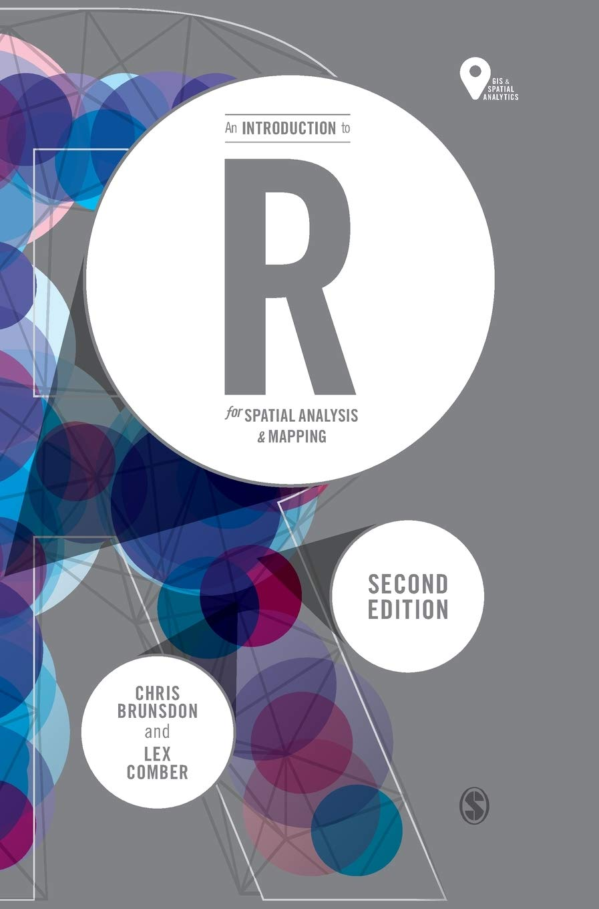
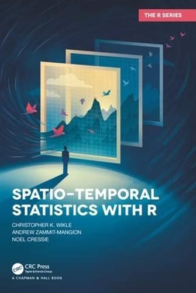
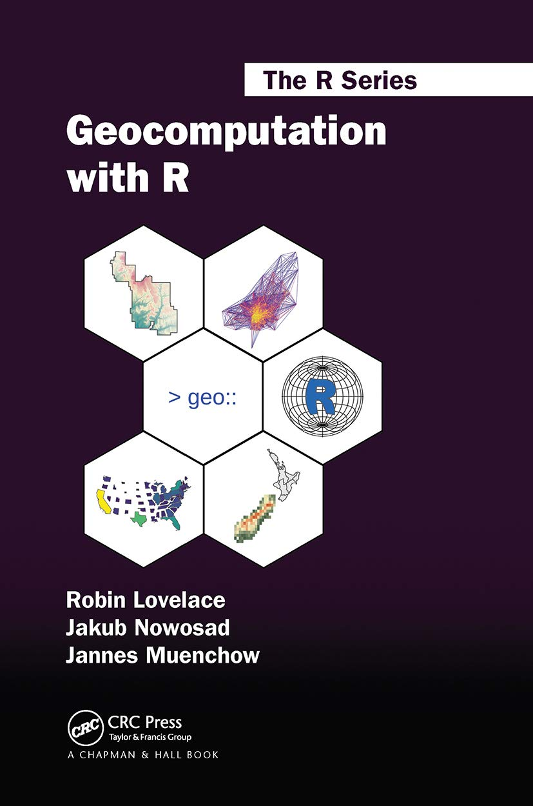
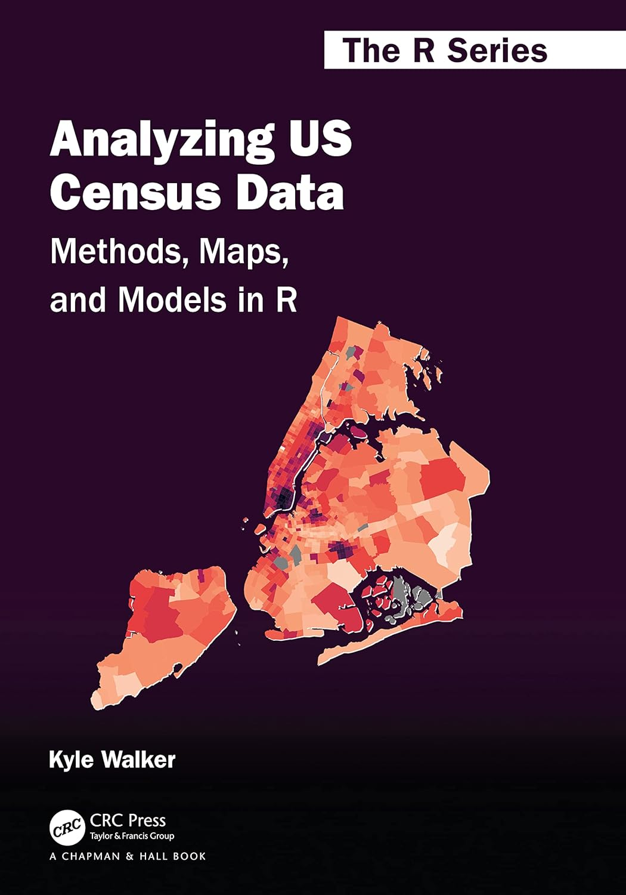

## Agenda
<hr>
::: {.incremental}
1. Constructs & Frameworks
:::

## Positionality {.unnumbered .unlisted}
<hr>
::: {layout="[3,2]" .fragment}

* White, cis, female, FGLI
* Originally from East TN
* Taught secondary math, AP® Statistics, and computer science in Eastern KY for 6 years
* Facilitator of professional learning for 5+ years

```{r, warning=FALSE, message=FALSE}
#| fig-cap:
#|  - "Greene County, TN"
#|  - "Floyd County, KY" 
#| fig-height: 4
#| fig-format: retina
library(tidyverse)
library(ussf)
library(sf)
us_counties18sf <- boundaries(geography="county")
us_states18sf <- boundaries(geography="state")
us_counties18sf_tn <- subset(us_counties18sf,STATEFP %in% c("47"))
us_counties18_easttn <- subset(us_counties18sf_tn,COUNTYFP %in% c("091","163","019","171",
                                                          "179","073","067",
                                                          "013","057","063","029",
                                                          "089","025","173","093",
                                                          "155","151","001","129",
                                                          "145","105","123","009"))
us_counties18_greeneco <- subset(us_counties18sf_tn,COUNTYFP %in% c("059"))
us_states18sf <- subset(us_states18sf, STATEFP %in% c("47"))
us_states18sf <- subset(us_states18sf, STATEFP %in% c("47"))

greene_co_tn <- ggplot() +
  geom_sf(data=us_counties18_easttn, fill="#ffffff", color="#262626", lwd=.5, show.legend=NA)+
  geom_sf(data=us_counties18_greeneco, fill="#7B8400", color="#262626", lwd=.5, show.legend=NA)+
  geom_sf(data=us_states18sf, fill=NA, color="#262626", lwd=1, show.legend = NA)+
  theme(text = element_text(family="Roboto Condensed"),
        axis.text.x = element_blank(),
        axis.text.y = element_blank(),
        axis.ticks = element_blank(),
        legend.key = element_blank(),
        legend.background = element_blank(),
        panel.grid.major = element_blank(),
        panel.background = element_blank())

greene_co_tn

us_counties18sf <- boundaries(geography="county")
us_states18sf <- boundaries(geography="state")
us_counties18sf_ky <- subset(us_counties18sf,STATEFP %in% c("21"))
us_counties18_easternky <- subset(us_counties18sf_ky,COUNTYFP %in% c("195","119","133","153","115","159","127","175","205","063","043","019",
"089","135","161","201","023","191","081","077","015","117","037","069",
"011","165","237","025","129","197","065","173","181","017","097","049","151",
"067","239","113","079","167","021","137","187","041","223","103","211","073",
"005","231","147","235","013","095","193","131","051","189","109","203","199",
"125","121"))
us_counties18_floydco <- subset(us_counties18sf_ky,COUNTYFP %in% c("071"))
us_states18sf <- subset(us_states18sf, STATEFP %in% c("21"))

floyd_co_ky <- ggplot() +
  geom_sf(data=us_counties18_easternky, fill="#ffffff", color="#262626", lwd=.5, show.legend=NA)+
  geom_sf(data=us_counties18_floydco, fill="#0D8C98", color="#262626", lwd=.5, show.legend=NA)+
  geom_sf(data=us_states18sf, fill=NA, color="#262626", lwd=1, show.legend = NA)+
  theme(text = element_text(family="Roboto Condensed"),
        legend.key.size = unit(1.5,"line"),
        axis.text.x = element_blank(),
        axis.text.y = element_blank(),
        axis.ticks = element_blank(),
        plot.margin = margin(r=20,t=10,l=20,b=1),
        legend.position="bottom",
        legend.key = element_blank(),
        legend.background = element_blank(),
        legend.text = element_text(colour="#131521", size=8),
        legend.box.spacing = margin(1),
        legend.margin = margin(t=20),
        legend.box.margin=margin(t=-10),
        legend.title = element_text(colour="#131521", size=10),
        panel.grid.major = element_blank(),
        panel.background = element_blank())

floyd_co_ky
```

:::

## Why Space?
<hr>
::: {.incremental}

* We explore dimensions of:
  + Class, gender, race/ethnicity, dis/ability, age, sexual orientation, parental education, language, etc...
  
* Why space? Why now?
  + Data availability
  + Spatial analysis techniques
  
:::

::::::{layout="[1,1,1,1,1,1]" .fragment .timeline}

{fig-alt="HexSticker for the sf package" height=150px}<br>
2017

{fig-alt="Book cover of *An Introduction to R for Spatial Data Analysis and Mapping*" height=150px}<br>
2019

{fig-alt="Book cover of *Spatio-Temporal Statistics with R*" height=150px}<br>
2019

{fig-alt="Book cover of *Geocomputation with R*" height=150px}<br>
2020

{fig-alt="Book cover of *Analyzing US Census Data*" height=150px}<br>
2023

{fig-alt="Book cover of *Spatial Data Science with Applications in R*" height=150px}<br>
2023

::::::
