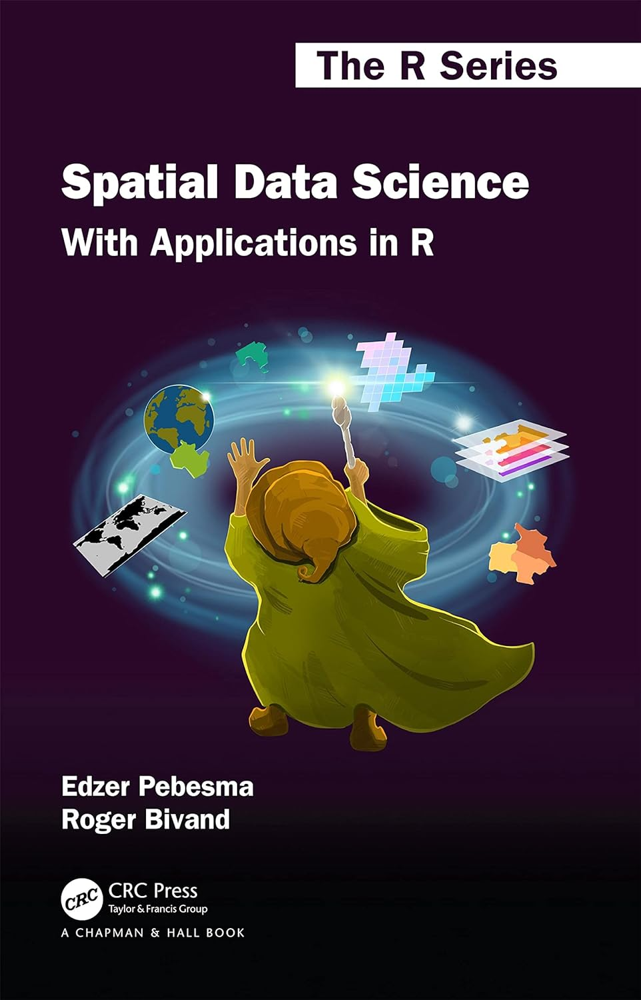
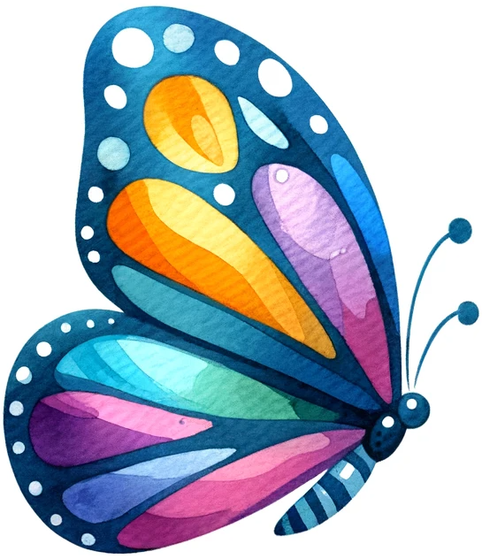
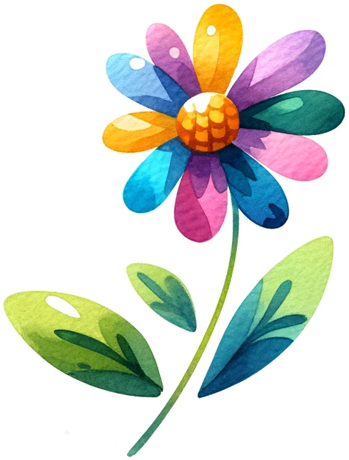
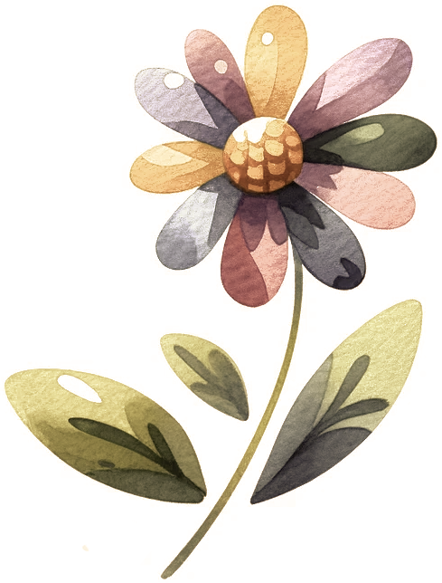
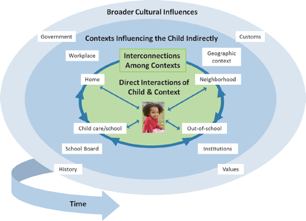

## Agenda

<hr>

::: incremental
1.  Research Overview & Frameworks
2.  Focal Research---*U.S. Landscape of Advanced Secondary STEM*
    i) Student Availability
    ii) Student Success
    iii) Teacher Learning Resources
3. Future Work
4. Questions
:::

## Positionality {.unnumbered .unlisted}

<hr>

::: {.fragment layout="[3,2]"}
-   White, cis, female, FGLI
-   Originally from East TN
-   Taught secondary math, AP® Statistics, and computer science in Eastern KY for 6 years
-   Facilitator of professional learning for 5+ years

```{r, warning=FALSE, message=FALSE}
#| fig-cap:
#|  - "Greene County, TN"
#|  - "Floyd County, KY" 
#| fig-height: 4
#| fig-format: retina
library(tidyverse)
library(ussf)
library(sf)
us_counties18sf_tn <- subset(boundaries(geography="county"),STATEFP %in% c("47"))
us_counties18_easttn <- subset(us_counties18sf_tn,COUNTYFP %in% c("091","163","019","171",
                                                          "179","073","067",
                                                          "013","057","063","029",
                                                          "089","025","173","093",
                                                          "155","151","001","129",
                                                          "145","105","123","009"))


us_counties18_greeneco <- subset(us_counties18sf_tn,COUNTYFP %in% c("059"))
us_states18sf <- subset(boundaries(geography="state"), STATEFP %in% c("47"))


greene_co_tn <- ggplot() +
  geom_sf(data=us_counties18_easttn, fill="#ffffff", color="#262626", lwd=.5, show.legend=NA)+
  geom_sf(data=us_counties18_greeneco, fill="#7B8400", color="#262626", lwd=.5, show.legend=NA)+
  geom_sf(data=us_states18sf, fill=NA, color="#262626", lwd=1, show.legend = NA)+
  theme(text = element_text(family="Roboto Condensed"),
        axis.text.x = element_blank(),
        axis.text.y = element_blank(),
        axis.ticks = element_blank(),
        legend.key = element_blank(),
        legend.background = element_blank(),
        panel.grid.major = element_blank(),
        panel.background = element_blank())

greene_co_tn

us_counties18sf_ky <- subset(boundaries(geography="county"),STATEFP %in% c("21"))
us_counties18_easternky <- subset(us_counties18sf_ky,COUNTYFP %in% c("195","119","133","153","115","159","127","175","205","063","043","019",
"089","135","161","201","023","191","081","077","015","117","037","069",
"011","165","237","025","129","197","065","173","181","017","097","049","151",
"067","239","113","079","167","021","137","187","041","223","103","211","073",
"005","231","147","235","013","095","193","131","051","189","109","203","199",
"125","121"))
us_counties18_floydco <- subset(us_counties18sf_ky,COUNTYFP %in% c("071"))
us_states18sf <- subset(boundaries(geography="state"), STATEFP %in% c("21"))

floyd_co_ky <- ggplot() +
  geom_sf(data=us_counties18_easternky, fill="#ffffff", color="#262626", lwd=.5, show.legend=NA)+
  geom_sf(data=us_counties18_floydco, fill="#0D8C98", color="#262626", lwd=.5, show.legend=NA)+
  geom_sf(data=us_states18sf, fill=NA, color="#262626", lwd=1, show.legend = NA)+
  theme(text = element_text(family="Roboto Condensed"),
        legend.key.size = unit(1.5,"line"),
        axis.text.x = element_blank(),
        axis.text.y = element_blank(),
        axis.ticks = element_blank(),
        plot.margin = margin(r=20,t=10,l=20,b=1),
        legend.position="bottom",
        legend.key = element_blank(),
        legend.background = element_blank(),
        legend.text = element_text(colour="#131521", size=8),
        legend.box.spacing = margin(1),
        legend.margin = margin(t=20),
        legend.box.margin=margin(t=-10),
        legend.title = element_text(colour="#131521", size=10),
        panel.grid.major = element_blank(),
        panel.background = element_blank())

floyd_co_ky
```
:::

## Why Space?

<hr>

::: incremental
-   We explore dimensions of:
    -   Class, gender, race/ethnicity, dis/ability, age, sexual orientation, parental education, language, etc...
-   Why space? Why now?
    -   Data availability
    -   Spatial analysis techniques
:::

::: {.fragment .timeline layout="[1,1,1,1,1,1]"}
{fig-alt="HexSticker for the sf package" height="150px"}<br> 2017

{fig-alt="Book cover of *An Introduction to R for Spatial Data Analysis and Mapping*" height="150px"}<br> 2019

{fig-alt="Book cover of *Spatio-Temporal Statistics with R*" height="150px"}<br> 2019

{fig-alt="Book cover of *Geocomputation with R*" height="150px"}<br> 2020

{fig-alt="Book cover of *Analyzing US Census Data*" height="150px"}<br> 2023

{fig-alt="Book cover of *Spatial Data Science with Applications in R*" height="150px"}<br> 2023
:::

---

##  {#introduction data-menu-title="Research Mission" background="#010130"}

<div class="page-center">
<div class="custom-subtitle">**identify, examine, and address spatial inequities in learning opportunities**</div></div>
---

## **Frameworks:** Spatial Theory

::: {.absolute top="0" left="100%"}
::: {.sectionhead}
1 [2 3 4 6]{style="opacity:0.25"}
:::
:::

<hr>

<br>[**Critical spatial theory**]{.green}[^1] calls for the interrogation of:

> "the intersections of space, power, and knowledge in order to expose geographies that perpetuate or disrupt inequities in both processes and outcomes" <br><br>(Annamma et al., 2010, p. 4) [^2]

[^1]: Soja, E. W. (2010). Seeking spatial justice. Minneapolis, MN: University of Minnesota Press.
[^2]:Annamma, S. A., Morrison, D., & Jackson, D. D. (2017). Searching for educational equity through critical spatial analysis. In D. Morrison, S. A. Annamma, & D. D. Jackson (Eds.), Critical race spatial analysis: Mapping to understand and address educational inequity (pp. 3-7). Stylus.

## **Frameworks:** Ecosystem Health

::: {.absolute top="0" left="100%"}
::: {.sectionhead}
1 [2 3 4 6]{style="opacity:0.25"}
:::
:::

<hr>

<br>

:::: {layout="[-3,2,3,-3]"}

{fig-alt="Colorful butterfly is example of indicator species" height="150px" .fragment}<br> [Indicator]{.fragment}


{fig-alt="Colorful flower is example of keystone species" width="266px" height="350px" .fragment}<br> [Keystone]{.fragment}
::::

## **Frameworks:** Ecosystem Health

::: {.absolute top="0" left="100%"}
::: {.sectionhead}
1 [2 3 4 6]{style="opacity:0.25"}
:::
:::

<hr>

<br>

:::: {layout="[-3,2,3,-3]"}

[](images/butterfly.png){height="150px"}

{fig-alt="Browning flower is example of declining health of keystone species/ecosystem" width="266px" height="350px"}<br> Keystone
::::

## **Frameworks:** Ecosystem Health

<hr>

::: {.absolute top="0" left="100%"}
::: {.sectionhead}
1 [2 3 4 6]{style="opacity:0.25"}
:::
:::

Like the butterfly and flora...

> "When youth are thriving, interested, and learning in a classroom, neighborhood, or informal learning program, we know the system is healthy. When they are struggling, we know the system is not healthy. Seeing learners as indicators could allow educational researchers to focus on youth as critical barometers of ecosystem health, while shifting energy away from creating interventions that target youth outcomes."<br><br>(Hecht & Crowley, 2020, p. 276) [^3]

[^3]: Hecht, M. & Crowley, K. (2020). Unpacking the learning ecosystems framework: Lessons from the adaptive management of biological ecosystems. Journal of the Learning Sciences, 29(2), 264-284. https://doi.org/10.1080/10508406.2019.1693381

## **Frameworks:** Ecosystem Health

::: {.absolute top="0" left="100%"}
::: {.sectionhead}
1 [2 3 4 6]{style="opacity:0.25"}
:::
:::

<hr>

::: {.r-stack .center}

{fig-alt="Picture of child who is centered in the STEM Learning Ecosystem Model" height="200px" .fragment}<br> [[**Indicator**]{.purple}<br>Student STEM Learning]{.fragment}

{fig-alt="Picture of the STEM Learning Ecosystem Model" height="383px" top="5px" .fragment}<br> [STEM Learning Ecosystem Model[^4]]{.fragment}

:::

[^4]: Used with permission of The National Academies Press, from Identifying and Supporting Productive STEM Programs in Out-of-School Settings, National Research Council, 2015; permission conveyed through Copyright Clearance Center, Inc.

## **Frameworks:** Ecosystem Health

<hr>

::: {.absolute top="0" left="100%"}
::: {.sectionhead}
1 [2 3 4 5]{style="opacity:0.25"}
:::
:::

::::{layout="[4,-1,5]"}
:::{.center}

{fig-alt="Picture of a teacher with a brain superimposed showing lots of thinking and ideas" height="360px" .fragment}<br> [[**Keystone**]{.purple}<br>STEM Teacher Learning]{.fragment}
:::

<br>[“Creating a profession of teaching in which teachers have the opportunity for continual learning is the likeliest way to inspire greater achievement for children...”<br><br>[(Darling-Hammond, 2008, p. 99)]{.smaller-font} [^5]]{.fragment}

[^5]: Darling-Hammond, L. (2008). Teacher learning that supports student learning. In B. Z. Presseisen (Ed.), Teaching for intelligence (pp. 91 - 100). Corwin.

::::

## **Frameworks:** Opportunities to Learn

<hr>

::: {.absolute top="0" left="100%"}
::: {.sectionhead}
1 [2 3 4 5]{style="opacity:0.25"}
:::
:::

::: incremental

* What are the necessary conditions for learning?
  + [**Opportunities to Learn (OTL):**]{.green} "Affordances for changing participation and practice"  [(Greeno & Gresalfi, 2008, p. 172)]{.smaller-font}[^6]
  + Three conditions[^7]:
    - Availability
    - Accessibility
    - [Learner dispositions]{style="opacity:0.35"}

:::
  
[^6]: Greeno, J. G. & Gresalfi, M. S. (2008). Opportunities to learn in practice and identity. In P. A. Moss, D. C. Pullin, J. P. Gee, E. H. Haertel, & L. J. Young (Eds.), Assessment, equity, and opportunity to learn (pp. 170-199). Cambridge University Press. https://doi.org/10.1017/CBO9780511802157.009
[^7]: Norman, D. A. (1988). The psychology of everyday things. Basic Books.
---

##  {#study-intros data-menu-title="Three Studies" background="#010130"}

<div class="page-center">
<div class="custom-subtitle">**THREE STUDIES**</div></div>

##  {#study-1 data-menu-title="Study One" background="#010130"}

<div class="page-center">
<div class="custom-subtitle-two">**STUDY ONE**
<br>[Geographic *Availability* of Secondary Advanced STEM]{.section-subtitle}
<br>[[Student Learning = Indicator Study]]{.section-subtitle-two}</div></div>
---

## **Study 1:** Context

<hr>

::: {.absolute top="0" left="100%"}
::: {.sectionhead}
[1]{style="opacity:0.25"} 2 [3 4 5]{style="opacity:0.25"}
:::
:::

---

##  {#study-2 data-menu-title="Study Two" background="#010130"}

<div class="page-center">
<div class="custom-subtitle-two">**STUDY TWO**
<br>[Geographic *Accessibility* of Advanced STEM Success]{.section-subtitle}
<br>[[Student Learning = Indicator Study]]{.section-subtitle-two}</div></div>
---

## **Study 2:** Context

<hr>

::: {.absolute top="0" left="100%"}
::: {.sectionhead}
[1 2]{style="opacity:0.25"} 3 [4 5]{style="opacity:0.25"}
:::
:::

<br>

::: incremental

* Only AP® conducts an end-of-course examination<br> (not PLTW®)
* Success (passing the exam; 3+) demonstrates access to the course content
* Equity concerns as related to AP® examination success

:::

## **Study 2:** AP® Exams & Equity

<hr>

::: {.absolute top="0" left="100%"}
::: {.sectionhead}
[1 2]{style="opacity:0.25"} 3 [4 5]{style="opacity:0.25"}
:::
:::

::: incremental

* Race/Ethnicity
  + All groups seeing improved enrollment in AP® [^]
  + Multi-year sustained decrease in pass rates among Black, Latinx, and Native American students
* Socioeconomic Status (SES)
  + Low-SES exam-taking has improved; still underrepresented
  + Pass rate is 17% lower than more affluent peers

:::

## **Study 2:** AP® Exams & Equity

<hr>

::: {.absolute top="0" left="100%"}
::: {.sectionhead}
[1 2]{style="opacity:0.25"} 3 [4 5]{style="opacity:0.25"}
:::
:::

::: incremental

* Gender
  + Women are underrepresented in Computer Science A, Physics, & Calculus exams
  + Men outperform women across all AP® STEM exams
* Geographic Locale
  +
  +

:::

---

##  {#study-3 data-menu-title="Study Three" background="#010130"}

<div class="page-center">
<div class="custom-subtitle-two">**STUDY THREE**
<br>[Community Variation in STEM Teacher Learning]{.section-subtitle}
<br>[[Teacher Learning = Keystone Study]]{.section-subtitle-three}</div></div>
---

## **Study 3:** Context

<hr>

::: {.absolute top="0" left="100%"}
::: {.sectionhead}
[1 2 3]{style="opacity:0.25"} 4 [5]{style="opacity:0.25"}
:::
:::

---

##  {#future-work data-menu-title="Future Work" background="#010130"}

<div class="page-center">
<div class="custom-subtitle-two">**FUTURE WORK**</div></div>
---

## **Future Work**

<hr>

::: {.absolute top="0" left="100%"}
::: {.sectionhead}
[1 2 3 4]{style="opacity:0.25"} 5
:::
:::

---

##  {#thank-you data-menu-title="Thank You" background="#010130"}

<div class="page-center">
<div class="custom-subtitle">**THANK YOU**
<br><br>[Questions?]{.section-subtitle}</div></div>